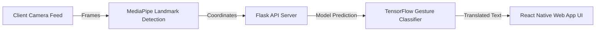

# 🤟 ISL Bridge — Real-time Indian Sign Language Translator

ISL Bridge is an Indian Sign Language AI translator built for accessibility and seamless communication. It tracks hand gestures in real-time using MediaPipe pose tracking, processes them using a TensorFlow deep learning classifier, and presents them in a mobile-ready React Native interface.

---

## 🚀 Key Features

* **Real-time Sign Detection**: Integrates **MediaPipe Tasks Vision** to map hand skeleton coordinates directly from a live camera feed.
* **Deep Learning Classifier**: Custom **TensorFlow** (`isl_model.h5`/`isl_model.keras`) classifying alphabet letters with a high prototype accuracy of **96-98%**.
* **Flask API Server**: Robust python backend for hosting predictions and performing lightweight inferences.
* **Cross-platform Frontend**: Polished mobile web interface built with **React Native / Expo** and styled with **Tailwind CSS**.

---

## 🛠️ System Architecture



---

## 📦 Repository Structure

```
indiansignlanguage/ (or isl-bridge/)
├── backend/
│   ├── model/                  # Trained models (.h5, .keras) and label maps
│   ├── app.py                  # Flask web server
│   ├── Procfile                # Heroku deployment configuration
│   └── requirements.txt        # Python packages
├── frontend/
│   ├── src/                    # React Native application source
│   ├── App.js                  # App main wrapper
│   ├── AppContext.js           # Shared state management
│   ├── package.json            # React Native dependencies
│   └── tailwind.config.js      # CSS configuration
└── docs/                       # Hackathon briefs, scripts, and logs
```

---

## ⚙️ Quick Start

### Backend Setup
1. **Navigate to backend**:
   ```bash
   cd backend
   ```
2. **Create and activate venv**:
   ```bash
   python -m venv venv
   # On Windows:
   venv\Scripts\activate
   # On Mac/Linux:
   source venv/bin/activate
   ```
3. **Install Dependencies**:
   ```bash
   pip install -r requirements.txt
   ```
4. **Run the server**:
   ```bash
   python app.py
   ```

### Frontend Setup
1. **Navigate to frontend**:
   ```bash
   cd ../frontend
   ```
2. **Install modules**:
   ```bash
   npm install
   ```
3. **Start Expo dev server**:
   ```bash
   npm run web
   ```
